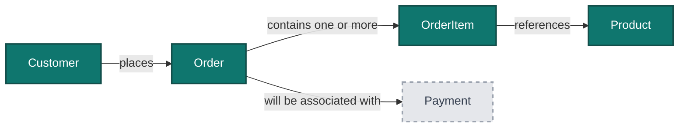
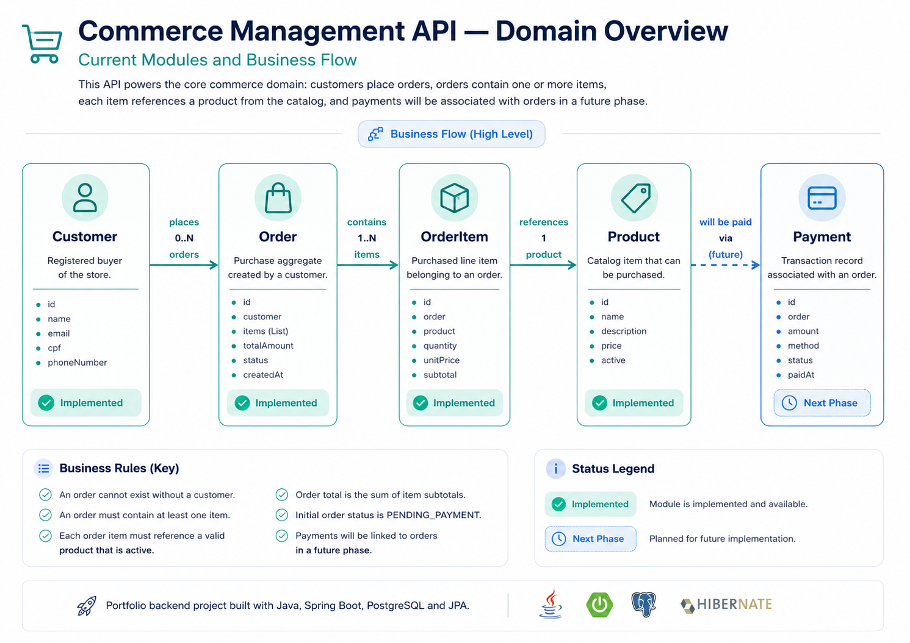
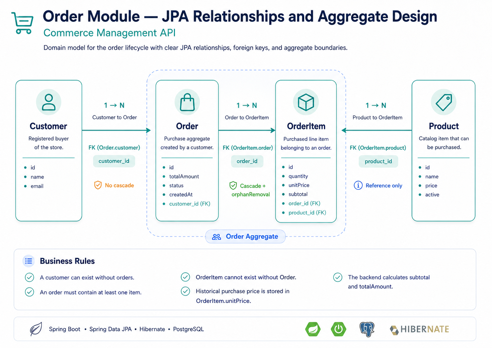
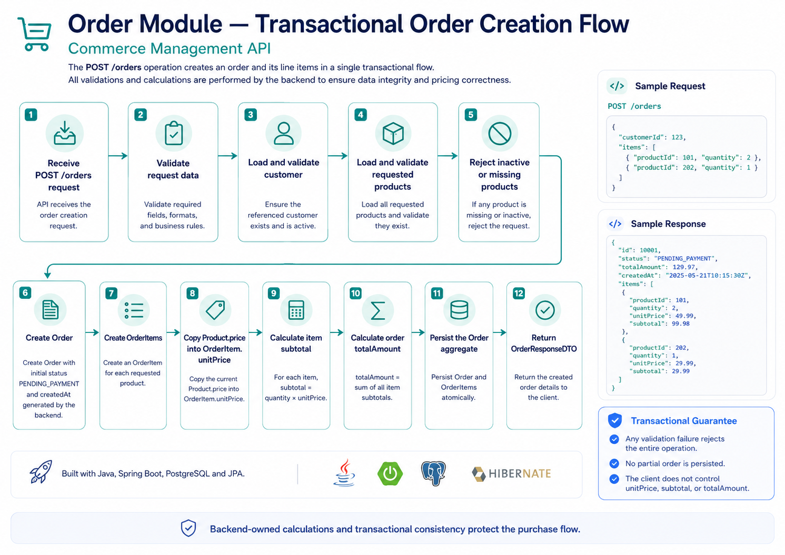
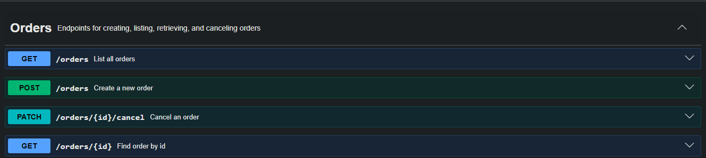

<p align="center">
  
  
  
  
  
  
</p>

<p align="center">
  
  
  
  
</p>

---

# Commerce Management API

## About This Project

**Commerce Management API** is a backend project built with **Java 21, Spring Boot 3, PostgreSQL, Spring Data JPA, Flyway and OpenAPI**, designed to simulate the core flow of a real commerce system.

The project started as a customer management API and is evolving incrementally into a broader commerce backend with connected business modules, relational modeling and real-world business rules.

At the current stage, the project includes:

- Customer management
- Product management
- Product activation and deactivation
- Order creation and retrieval
- Order cancellation
- Customer, Product, Order and OrderItem relationships
- Historical product price preservation
- Backend-calculated subtotals and order totals
- RESTful endpoints
- DTO pattern
- Bean Validation
- Centralized exception handling
- Pagination and sorting
- PostgreSQL integration
- Flyway database migrations
- Swagger/OpenAPI documentation

The goal is to build a portfolio-level backend project applying professional practices commonly used in real-world software engineering teams.

---

## Project Vision

The long-term goal is to simulate the backend core of a commercial platform where customers can register, products can be managed, and orders can be created from active products.

Core business flow:

```text
Customer places an Order
Order contains one or more OrderItems
Each OrderItem references a Product
Product price is preserved at the moment of purchase
Order subtotal and total amount are calculated by the backend
Order follows a controlled business status lifecycle
```

Current domain implementation status:

```text
Customer  → implemented
Product   → implemented
Order     → implemented
OrderItem → implemented
Payment   → future phase
```

---

## Domain Overview

The diagram below provides a high-level view of the current and planned domain modules.



> `Customer`, `Product`, `Order` and `OrderItem` are currently implemented. `Payment` is planned for a future phase.

---

## Project Documentation

### Commerce Domain Overview

The diagram below provides a high-level view of the Commerce Management API domain and its current implementation status.

Customer, Product, Order and OrderItem are already implemented and connected through the main commerce business flow. Payment is planned as the next project phase.



### Order Module — JPA Relationships and Aggregate Design

The Order module introduces the first multi-entity business aggregate in the project.

A customer may place multiple orders, while each order belongs to exactly one customer. Every order contains one or more order items, and each item references a product from the catalog.

`Order` controls the lifecycle of its `OrderItem` collection through cascade operations and orphan removal. Customer and Product remain independent entities and are referenced without cascading their lifecycle into the order aggregate.

The model also preserves the product price at the moment of purchase by copying `Product.price` into `OrderItem.unitPrice`. This prevents future product price changes from modifying historical orders.



### Transactional Order Creation Flow

Creating an order involves more than inserting a record into the database.

The backend validates the request, verifies that the customer exists, validates that every requested product exists and is active, creates the order items, preserves each product's current price and calculates all monetary values internally.

The entire operation is executed as a single transaction. If the customer or any product is invalid, the complete operation is rejected and no partial order is persisted.

This approach protects data consistency and prevents the API client from controlling sensitive values such as `unitPrice`, `subtotal` and `totalAmount`.



## Architecture Overview

This API follows a **Layered Architecture**, separating responsibilities to improve maintainability, testability and scalability.

```text
┌─────────────────────────────────┐
│          CLIENT (HTTP)          │
└────────────────┬────────────────┘
                 │
┌────────────────▼────────────────┐
│        CONTROLLER LAYER         │  ← HTTP requests, responses and endpoint mapping
└────────────────┬────────────────┘
                 │
┌────────────────▼────────────────┐
│          SERVICE LAYER          │  ← Business rules, validations and transactions
└────────────────┬────────────────┘
                 │
┌────────────────▼────────────────┐
│        REPOSITORY LAYER         │  ← Data access with Spring Data JPA
└────────────────┬────────────────┘
                 │
┌────────────────▼────────────────┐
│        PostgreSQL DATABASE      │  ← Data persistence
└─────────────────────────────────┘
```

---

## System Design

```text
Client
  │
  ▼
REST API
  │
  ├── CustomerController
  │       └── CustomerService
  │               └── CustomerRepository
  │
  ├── ProductController
  │       └── ProductService
  │               └── ProductRepository
  │
  └── OrderController
          └── OrderService
                  ├── OrderRepository
                  ├── CustomerRepository
                  └── ProductRepository

Spring Data JPA
  │
  ▼
PostgreSQL Database
  ▲
  │
Flyway Migrations
```

The `OrderService` coordinates multiple domain resources because creating an order requires validating the customer, validating every product, creating order items, calculating monetary values and persisting the complete aggregate.

---

## Current Domain Model

### Customer

The `Customer` domain represents a registered customer in the system.

```text
Customer
├── id           (Long)    — Auto-generated primary key
├── name         (String)  — Customer name
├── email        (String)  — Customer email
├── cpf          (String)  — Brazilian tax identifier
└── phoneNumber  (String)  — Customer phone number
```

### Product

The `Product` domain represents a product available in the commerce catalog.

```text
Product
├── id           (Long)          — Auto-generated primary key
├── name         (String)        — Product name
├── description  (String)        — Product description
├── price        (BigDecimal)    — Product current price
├── active       (boolean)       — Product availability status
├── createdAt    (LocalDateTime) — Creation timestamp
└── updatedAt    (LocalDateTime) — Last update timestamp
```

### Order

The `Order` domain represents a purchase created by one customer.

```text
Order
├── id           (Long)          — Auto-generated primary key
├── customer     (Customer)      — Customer responsible for the order
├── items        (List)          — Items included in the purchase
├── totalAmount  (BigDecimal)    — Total calculated by the backend
├── status       (OrderStatus)   — Current order business status
└── createdAt    (LocalDateTime) — Creation timestamp generated by the backend
```

### OrderItem

The `OrderItem` domain represents one product inside an order.

```text
OrderItem
├── id         (Long)       — Auto-generated primary key
├── order      (Order)      — Parent order
├── product    (Product)    — Referenced product
├── quantity   (Integer)    — Purchased quantity
├── unitPrice  (BigDecimal) — Product price preserved at purchase time
└── subtotal   (BigDecimal) — quantity × unitPrice
```

The historical price is stored in `OrderItem.unitPrice`. Therefore, changes to the current product price do not modify previously created orders.

---

## Order Creation Flow

Creating an order is not treated as a simple database insert. The backend coordinates a sequence of validations and calculations:

```text
1. Receive customerId and order items
2. Validate that the customer exists
3. Validate that every product exists
4. Reject inactive products
5. Create the Order with its initial status
6. Create one OrderItem for each requested product
7. Copy the current Product price into OrderItem.unitPrice
8. Calculate every item subtotal
9. Calculate Order.totalAmount
10. Persist the order aggregate
11. Return the order response
```

Main business rules:

- An order belongs to exactly one customer
- An order must contain at least one item
- An invalid item rejects the entire order
- Inactive products cannot be included in new orders
- `OrderItem` cannot exist without its parent `Order`
- Monetary totals are calculated by the backend
- The client does not define the purchase price or final total
- A canceled order remains stored for historical consistency

---

## API Documentation

The API is documented using **OpenAPI 3.1** and **Swagger UI**.

After running the application locally, access:

```text
http://localhost:8080/swagger-ui/index.html
```

The Swagger documentation currently includes:

- API title, description, version and contact information
- Customer, Product and Order endpoint grouping
- Endpoint summaries with `@Operation`
- HTTP response documentation with `@ApiResponse`
- Request and response schemas
- Validation and business error documentation

---

## Swagger Screenshots

### API Overview

The API is documented using Swagger/OpenAPI, making it easier to explore and test the available endpoints.


### Customer Endpoints

The Customer module includes endpoints for creating, listing, searching, updating and deleting customers.


### Product Endpoints

The Product module includes endpoints for creating, listing, searching, updating, activating and deactivating products.


### Order Endpoints

The Order module includes endpoints for creating orders, listing all orders, retrieving an order by ID and canceling an existing order.



---

## API Endpoints

Base URL:

```text
http://localhost:8080
```

### Customer Endpoints

| Method | Endpoint | Description | Responses |
|---|---|---|---|
| GET | `/customers` | List all customers with pagination | 200 OK |
| POST | `/customers` | Create a new customer | 201 Created, 400 Bad Request |
| GET | `/customers/{id}` | Get customer by ID | 200 OK, 404 Not Found |
| GET | `/customers/email/{email}` | Get customer by email | 200 OK, 404 Not Found |
| PUT | `/customers/{id}` | Update customer data | 200 OK, 400 Bad Request, 404 Not Found |
| DELETE | `/customers/{id}` | Delete customer by ID | 204 No Content, 404 Not Found |

### Product Endpoints

| Method | Endpoint | Description | Responses |
|---|---|---|---|
| GET | `/products` | List all products with pagination | 200 OK |
| POST | `/products` | Create a new product | 201 Created, 400 Bad Request |
| GET | `/products/{id}` | Get product by ID | 200 OK, 404 Not Found |
| PUT | `/products/{id}` | Update product data | 200 OK, 400 Bad Request, 404 Not Found |
| PATCH | `/products/{id}/activate` | Activate a product | 200 OK, 404 Not Found |
| PATCH | `/products/{id}/deactivate` | Deactivate a product without deleting it | 200 OK, 404 Not Found |

### Order Endpoints

| Method | Endpoint | Description | Responses |
|---|---|---|---|
| GET | `/orders` | List all orders | 200 OK |
| POST | `/orders` | Create a new order | 201 Created, 400 Bad Request, 404 Not Found |
| GET | `/orders/{id}` | Find an order by ID | 200 OK, 404 Not Found |
| PATCH | `/orders/{id}/cancel` | Cancel an existing order | 200 OK, 404 Not Found, 409 Conflict |

---

## Request and Response Examples

### Create Customer Request

```json
{
  "name": "João Silva",
  "email": "joao.silva@email.com",
  "cpf": "12345678900",
  "phoneNumber": "81999990000"
}
```

### Customer Response

```json
{
  "id": 1,
  "name": "João Silva",
  "email": "joao.silva@email.com"
}
```

### Create Product Request

```json
{
  "name": "Mouse Gamer",
  "description": "Mouse gamer with RGB lighting and adjustable DPI.",
  "price": 149.90
}
```

### Product Response

```json
{
  "id": 1,
  "name": "Mouse Gamer",
  "description": "Mouse gamer with RGB lighting and adjustable DPI.",
  "price": 149.90,
  "active": true,
  "createdAt": "2026-07-01T10:00:00",
  "updatedAt": null
}
```

### Create Order Request

```json
{
  "customerId": 1,
  "items": [
    {
      "productId": 1,
      "quantity": 2
    },
    {
      "productId": 2,
      "quantity": 1
    }
  ]
}
```

### Order Response

```json
{
  "id": 1,
  "customerId": 1,
  "status": "PENDING",
  "totalAmount": 349.70,
  "createdAt": "2026-07-17T10:30:00",
  "items": [
    {
      "productId": 1,
      "quantity": 2,
      "unitPrice": 149.90,
      "subtotal": 299.80
    },
    {
      "productId": 2,
      "quantity": 1,
      "unitPrice": 49.90,
      "subtotal": 49.90
    }
  ]
}
```

### Error Response

```json
{
  "status": 404,
  "message": "Product not found with id: 1",
  "timestamp": "2026-07-17T10:00:00"
}
```

### Validation Error Response

```json
{
  "status": 400,
  "message": "Validation failed",
  "errors": [
    "items: Order must contain at least one item",
    "quantity: Quantity must be greater than zero"
  ],
  "timestamp": "2026-07-17T10:00:00"
}
```

---

## Project Structure

```text
src/main/java
│
├── config                         ← OpenAPI and application configuration
├── controller                     ← Customer, Product and Order REST endpoints
├── service                        ← Business rules, validations and transactions
├── database
│   ├── entity                     ← Customer, Product, Order and OrderItem entities
│   └── repository                 ← Spring Data JPA repositories
├── dto                            ← Request and response API contracts
├── enums                          ← Business status types such as OrderStatus
├── exception                      ← Domain exceptions and global error handling
└── CommerceManagementApiApplication.java
```

```text
src/main/resources
│
├── application.yml                ← Application configuration
└── db
    └── migration                  ← Versioned Customer, Product, Order and OrderItem migrations
```

```text
docs
├── diagrams                       ← Domain relationships and order flow diagrams
└── images                         ← Swagger UI screenshots used in this README
```

---

## Tech Stack

| Layer / Purpose | Technology |
|---|---|
| Language | Java 21 |
| Framework | Spring Boot 3 |
| REST API | Spring Web |
| Persistence | Spring Data JPA / Hibernate |
| Database | PostgreSQL |
| Database Migrations | Flyway |
| Validation | Spring Validation |
| Documentation | SpringDoc OpenAPI / Swagger |
| Build Tool | Maven |
| Boilerplate Reduction | Lombok |
| Architecture | Layered Architecture |

---

## Engineering Decisions

### DTO Pattern

Entities are not exposed directly through the API.

Request and response DTOs keep the external API contract separated from the persistence model. This avoids leaking JPA relationships and internal database details to API consumers.

```text
HTTP Request
     │
     ▼
Request DTO
     │
     ▼
Service and Domain Model
     │
     ▼
Response DTO
     │
     ▼
HTTP Response
```

---

### Centralized Exception Handling

The project uses centralized exception handling with `@RestControllerAdvice`.

This avoids scattered `try/catch` blocks in controllers and provides consistent error responses across the API.

Current handled scenarios include:

- Customer not found
- Product not found
- Order not found
- Invalid or inactive product
- Invalid order state transitions
- Bean Validation errors
- Generic internal server errors

---

### Product Activation and Deactivation

Products are not physically deleted when they are no longer available.

```text
active = true   → product can be included in new orders
active = false  → product remains stored but cannot be included in new orders
```

This strategy preserves product records and protects historical order references.

---

### Order as an Aggregate

`Order` acts as the main aggregate for the purchase flow.

Its items are created and managed as part of the order lifecycle. `OrderItem` does not exist independently from its parent order, which keeps the domain model consistent and allows cascade operations and orphan removal to reflect the business relationship.

---

### Historical Price Strategy

The product's current price is copied into `OrderItem.unitPrice` when the order is created.

```text
Product.price          → current catalog price
OrderItem.unitPrice    → historical purchase price
```

Even if `Product.price` changes later, previously created orders retain the original value used in the transaction.

---

### Backend-Owned Calculations

The client sends product identifiers and quantities, but does not control monetary values.

```text
subtotal   = quantity × unitPrice
totalAmount = sum of all item subtotals
```

Both values are calculated by the backend to prevent inconsistent or manipulated order totals.

---

### Transactional Order Creation

Order creation changes multiple related records as one business operation.

Customer validation, product validation, item creation, total calculation and persistence must succeed together. If any item is invalid, the entire operation is rejected instead of creating a partial order.

---

### Order Cancellation

Canceling an order changes its business status instead of deleting the record.

This preserves historical information and prepares the system for future payment, audit and reporting requirements.

---

### Clean Code vs Documentation Trade-off

During Swagger integration, the `Pageable` parameter was displayed in a less friendly way by Swagger UI.

Instead of refactoring a clean Spring implementation only to improve the visual output, the current approach was preserved because:

- The endpoint works correctly
- Postman validates the expected behavior
- The implementation remains idiomatic with Spring Data
- The limitation does not affect business value or API behavior

This reflects a real engineering trade-off: not every documentation limitation requires changing working production code.

---

### Layered Architecture

Responsibilities are clearly separated:

```text
Controller  → handles HTTP requests and responses
Service     → contains business rules, validations and transactions
Repository  → handles database access through Spring Data JPA
DTO         → defines API input and output contracts
Entity      → represents the persistence model
Config      → centralizes application-level configuration
Exception   → centralizes domain and API error handling
```

---

## Engineering Roadmap

The project evolves incrementally following backend engineering standards.

### Phase 1 — Customer API Foundation

- [x] Project setup
- [x] Database connection
- [x] Customer entity and repository
- [x] Customer service and controller
- [x] CRUD endpoints
- [x] DTO pattern
- [x] Exception handling
- [x] Validation
- [x] Pagination and sorting
- [x] Swagger documentation

### Phase 2 — Product Module

- [x] Product domain modeling
- [x] Product persistence
- [x] Product DTOs
- [x] Product creation, retrieval and update
- [x] Product listing with pagination
- [x] Product activation and deactivation
- [x] Product Swagger documentation
- [x] CustomerService refactoring for consistency

### Phase 3 — Order Module

- [x] Order domain modeling
- [x] Order module entity relationship diagram
- [x] Order creation flow diagram
- [x] `OrderStatus` business status
- [x] `Order` and `OrderItem` persistence model
- [x] JPA relationships and aggregate ownership
- [x] Order database migrations
- [x] Order request and response DTOs
- [x] Customer and product validation during order creation
- [x] Historical unit price preservation
- [x] Automatic subtotal and total calculation
- [x] Transactional order creation
- [x] Create order endpoint
- [x] List orders endpoint
- [x] Find order by ID endpoint
- [x] Cancel order endpoint
- [x] Order exception handling
- [x] Order Swagger documentation
- [x] Order module review and refactoring

### Phase 4 — Payment Module

- [ ] Payment domain modeling
- [ ] Payment status lifecycle
- [ ] Order-to-Payment relationship
- [ ] Payment processing simulation
- [ ] Payment API documentation
- [ ] Payment tests

### Phase 5 — Testing

- [ ] Unit tests with JUnit 5 and Mockito
- [ ] Integration tests with Spring Boot Test
- [ ] Testcontainers with PostgreSQL
- [ ] Test coverage report

### Phase 6 — Security

- [ ] Spring Security
- [ ] JWT authentication
- [ ] Role-based authorization
- [ ] Password encoding with BCrypt

### Phase 7 — Infrastructure and DevOps

- [ ] Dockerfile
- [ ] Docker Compose
- [ ] GitHub Actions CI/CD pipeline
- [ ] Health check endpoint with Spring Actuator

### Phase 8 — Scalability and Observability

- [ ] Redis cache layer
- [ ] Async messaging with RabbitMQ or Kafka
- [ ] Metrics with Prometheus and Grafana
- [ ] Distributed tracing

---

## Running Locally

### Prerequisites

- Java 21+
- Maven or Maven Wrapper
- PostgreSQL running locally

### Clone the repository

```bash
git clone https://github.com/SergioFeitosaa/commerce-management-api.git
cd commerce-management-api
```

### Run the application

```bash
./mvnw spring-boot:run
```

On Windows:

```bash
mvnw.cmd spring-boot:run
```

The application will run at:

```text
http://localhost:8080
```

Swagger UI will be available at:

```text
http://localhost:8080/swagger-ui/index.html
```

---

## Learning Goals

This project is being built incrementally to strengthen backend development skills in:

- Java backend development
- Spring Boot REST APIs
- Clean code and layered architecture
- Domain and business rule modeling
- JPA relationships
- Transaction management
- DTO design
- API documentation
- Database persistence
- Bean Validation
- Exception handling
- Database migrations with Flyway
- Testing strategies
- Security fundamentals
- DevOps and deployment practices

---

## Author

**Sérgio Ricardo Feitosa**

Backend Java Developer in progress, transitioning from a legal career into software engineering, focused on Java, Spring Boot, clean architecture and backend system design.

Building practical projects with consistency, documentation and real-world engineering decisions.

<p>
  <a href="https://www.linkedin.com/in/s%C3%A9rgiofeitosa/">
    
  </a>
  <a href="https://github.com/SergioFeitosaa">
    
  </a>
</p>