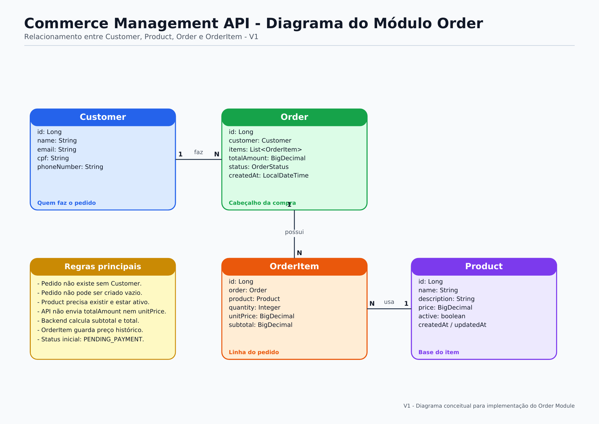
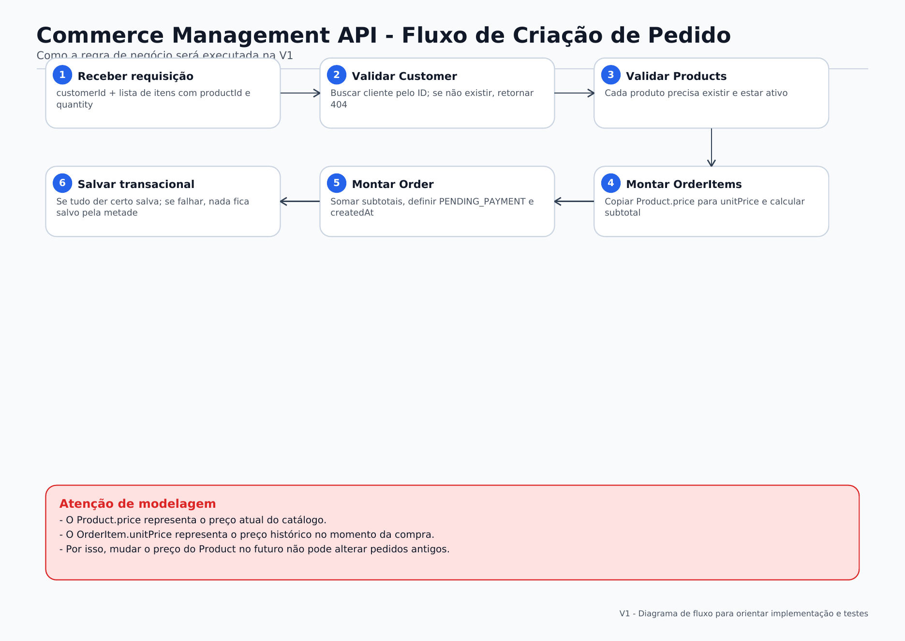
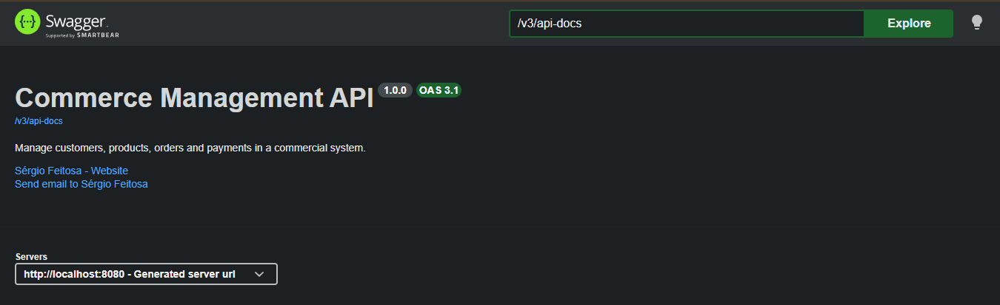
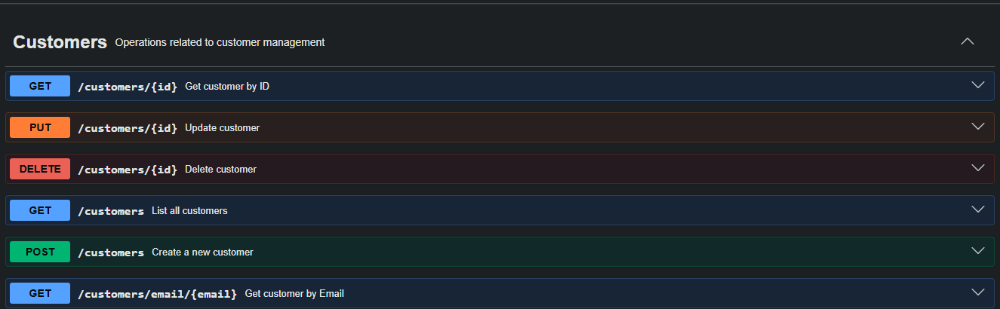
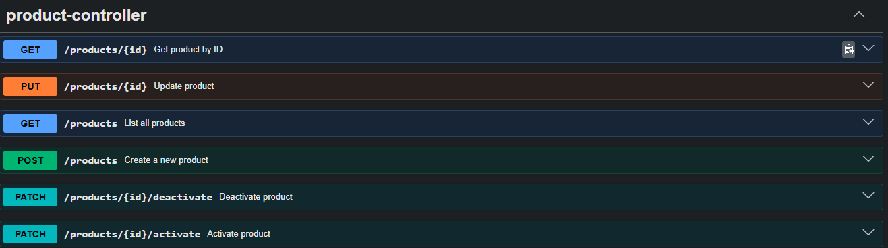

<p align="center">
  
  
  
  
  
  
</p>

<p align="center">
  
  
  
  
</p>

---

# Commerce Management API

## About This Project

**Commerce Management API** is a backend project built with **Java 21, Spring Boot 3, PostgreSQL, Spring Data JPA, Flyway and OpenAPI**, designed to simulate the core flow of a real commerce system.

The project started as a customer management API and is evolving incrementally into a broader commerce backend.

At the current stage, the project includes:

- Customer management
- Product management
- Product activation and deactivation
- RESTful endpoints
- DTO pattern
- Bean Validation
- Centralized exception handling
- Pagination and sorting
- PostgreSQL integration
- Flyway database migrations
- Swagger/OpenAPI documentation
- Initial Order module planning with diagrams

The goal is to build a portfolio-level backend project applying professional practices commonly used in real-world software engineering teams.

---

## Project Vision

The long-term goal is to simulate the backend core of a commercial platform where customers can register, products can be managed, and orders can be created based on active products.

Planned business flow:

```text
Customer places an Order
Order contains one or more OrderItems
Each OrderItem references a Product
Product price is preserved at the moment of purchase
Order total is calculated by the backend
Order has a business status
```

Current and planned domain model:

```text
Customer
Product
Order
OrderItem
Payment
```

Current implementation status:

```text
Customer  → implemented
Product   → implemented
Order     → planned next
OrderItem → planned next
Payment   → future phase
```

---

## Project Documentation

### Order Module Entity Relationship Diagram

The diagram below shows how the main domain entities are connected in the planned Order module.



### Order Creation Flow

The diagram below shows the planned flow for creating an order, including customer validation, product validation, historical price registration, subtotal calculation and total amount calculation.



### PDF Version

You can also access the full PDF version here:

[Order Module Entity Relationship Diagram PDF](docs/diagrams/order-module-entity-relationship-diagram.pdf)

---

## Architecture Overview

This API follows a **Layered Architecture**, separating responsibilities to improve maintainability, testability and scalability.

```text
┌─────────────────────────────────┐
│          CLIENT (HTTP)          │
└────────────────┬────────────────┘
                 │
┌────────────────▼────────────────┐
│        CONTROLLER LAYER         │  ← HTTP requests, responses and endpoint mapping
└────────────────┬────────────────┘
                 │
┌────────────────▼────────────────┐
│          SERVICE LAYER          │  ← Business rules, validations and transactions
└────────────────┬────────────────┘
                 │
┌────────────────▼────────────────┐
│        REPOSITORY LAYER         │  ← Data access with Spring Data JPA
└────────────────┬────────────────┘
                 │
┌────────────────▼────────────────┐
│        PostgreSQL DATABASE      │  ← Data persistence
└─────────────────────────────────┘
```

---

## System Design

```text
Client
  │
  ▼
REST API
  │
  ├── CustomerController
  │       │
  │       ▼
  │   CustomerService
  │       │
  │       ▼
  │   CustomerRepository
  │
  └── ProductController
          │
          ▼
      ProductService
          │
          ▼
      ProductRepository

Spring Data JPA
  │
  ▼
PostgreSQL Database
  ▲
  │
Flyway Migrations
```

---

## Current Domain Model

### Customer

The `Customer` domain represents a registered customer in the system.

```text
Customer
├── id           (Long)    — Auto-generated primary key
├── name         (String)  — Customer name
├── email        (String)  — Customer email
├── cpf          (String)  — Brazilian tax identifier
└── phoneNumber  (String)  — Customer phone number
```

### Product

The `Product` domain represents a product available in the commerce catalog.

```text
Product
├── id           (Long)          — Auto-generated primary key
├── name         (String)        — Product name
├── description  (String)        — Product description
├── price        (BigDecimal)    — Product current price
├── active       (boolean)       — Product availability status
├── createdAt    (LocalDateTime) — Creation timestamp
└── updatedAt    (LocalDateTime) — Last update timestamp
```

### Planned Order Module

The next phase of the project will introduce:

```text
Order
├── id
├── customer
├── items
├── totalAmount
├── status
└── createdAt

OrderItem
├── id
├── order
├── product
├── quantity
├── unitPrice
└── subtotal
```

The `OrderItem` entity will preserve the product price at the moment of purchase to keep historical order data consistent.

---

## API Documentation

The API is documented using **OpenAPI 3.1** and **Swagger UI**.

After running the application locally, access:

```text
http://localhost:8080/swagger-ui/index.html
```

The Swagger documentation currently includes:

- API title, description, version and contact information
- Customer endpoint grouping
- Product endpoint grouping
- Endpoint summaries with `@Operation`
- HTTP response documentation with `@ApiResponse`
- Request and response schemas
- Validation error documentation

---

## Swagger Screenshots

### API Overview

The API is documented using Swagger/OpenAPI, making it easier to test and understand the available endpoints.



### Customer Endpoints

The Customer module includes endpoints for creating, listing, searching, updating and deleting customers.



### Product Endpoints

The Product module includes endpoints for creating, listing, searching, updating, activating and deactivating products.



---

## API Endpoints

Base URL:

```text
http://localhost:8080
```

### Customer Endpoints

| Method | Endpoint | Description | Responses |
|---|---|---|---|
| GET | `/customers` | List all customers with pagination | 200 OK |
| POST | `/customers` | Create a new customer | 201 Created, 400 Bad Request |
| GET | `/customers/{id}` | Get customer by ID | 200 OK, 404 Not Found |
| GET | `/customers/email/{email}` | Get customer by email | 200 OK, 404 Not Found |
| PUT | `/customers/{id}` | Update customer data | 200 OK, 400 Bad Request, 404 Not Found |
| DELETE | `/customers/{id}` | Delete customer by ID | 204 No Content, 404 Not Found |

### Product Endpoints

| Method | Endpoint | Description | Responses |
|---|---|---|---|
| GET | `/products` | List all products with pagination | 200 OK |
| POST | `/products` | Create a new product | 201 Created, 400 Bad Request |
| GET | `/products/{id}` | Get product by ID | 200 OK, 404 Not Found |
| PUT | `/products/{id}` | Update product data | 200 OK, 400 Bad Request, 404 Not Found |
| PATCH | `/products/{id}/activate` | Activate a product | 200 OK, 404 Not Found |
| PATCH | `/products/{id}/deactivate` | Deactivate a product without deleting it | 200 OK, 404 Not Found |

---

## Request and Response Examples

### Create Customer Request

```json
{
  "name": "João Silva",
  "email": "joao.silva@email.com",
  "cpf": "12345678900",
  "phoneNumber": "81999990000"
}
```

### Customer Response

```json
{
  "id": 1,
  "name": "João Silva",
  "email": "joao.silva@email.com"
}
```

### Create Product Request

```json
{
  "name": "Mouse Gamer",
  "description": "Mouse gamer with RGB lighting and adjustable DPI.",
  "price": 149.90
}
```

### Product Response

```json
{
  "id": 1,
  "name": "Mouse Gamer",
  "description": "Mouse gamer with RGB lighting and adjustable DPI.",
  "price": 149.90,
  "active": true,
  "createdAt": "2026-07-01T10:00:00",
  "updatedAt": null
}
```

### Product Deactivation Response

```json
{
  "id": 1,
  "name": "Mouse Gamer",
  "description": "Mouse gamer with RGB lighting and adjustable DPI.",
  "price": 149.90,
  "active": false,
  "createdAt": "2026-07-01T10:00:00",
  "updatedAt": "2026-07-01T15:30:00"
}
```

### Error Response

```json
{
  "status": 404,
  "message": "Product not found with id: 1",
  "timestamp": "2026-07-01T10:00:00"
}
```

### Validation Error Response

```json
{
  "status": 400,
  "message": "Validation failed",
  "errors": [
    "name: Product name is required",
    "price: Product price must be greater than zero"
  ],
  "timestamp": "2026-07-01T10:00:00"
}
```

---

## Project Structure

```text
src/main/java
│
├── config
│   └── OpenApiConfig.java                  ← OpenAPI / Swagger configuration
│
├── controller
│   ├── CustomerController.java             ← Customer REST endpoints
│   └── ProductController.java              ← Product REST endpoints
│
├── service
│   ├── CustomerService.java                ← Customer business logic
│   └── ProductService.java                 ← Product business logic
│
├── database
│   ├── entity
│   │   ├── Customer.java                   ← Customer persistence entity
│   │   └── Product.java                    ← Product persistence entity
│   │
│   └── repository
│       ├── CustomerRepository.java         ← Customer JPA data access
│       └── ProductRepository.java          ← Product JPA data access
│
├── dto
│   ├── CustomerRequestDTO.java             ← Customer request body
│   ├── CustomerResponseDTO.java            ← Customer API response
│   ├── ProductRequestDTO.java              ← Product request body
│   ├── ProductResponseDTO.java             ← Product API response
│   ├── ErrorResponseDTO.java               ← Standardized error response
│   └── ValidationErrorResponseDTO.java     ← Standardized validation error response
│
├── exception
│   ├── CustomerNotFoundException.java      ← Customer not found exception
│   ├── ProductNotFoundException.java       ← Product not found exception
│   └── GlobalExceptionHandler.java         ← Centralized exception handling
│
└── CustomerManagementApiApplication.java
```

```text
src/main/resources
│
├── application.yml                         ← Application configuration
│
└── db
    └── migration
        ├── V1__create-table-customer.sql   ← Customer table migration
        ├── V2__create-table-product.sql    ← Product table migration
        └── V3__make-product-updated-at-nullable.sql
```

---

## Tech Stack

| Layer / Purpose | Technology |
|---|---|
| Language | Java 21 |
| Framework | Spring Boot 3 |
| REST API | Spring Web |
| Persistence | Spring Data JPA / Hibernate |
| Database | PostgreSQL |
| Database Migrations | Flyway |
| Validation | Spring Validation |
| Documentation | SpringDoc OpenAPI / Swagger |
| Build Tool | Maven |
| Boilerplate Reduction | Lombok |
| Architecture | Layered Architecture |

---

## Engineering Decisions

### DTO Pattern

Entities are not exposed directly through the API.

The project uses request and response DTOs to keep the API contract separated from the persistence model.

```text
Customer Entity              CustomerResponseDTO
     │                               │
     ├── JPA annotations              ├── Clean API response
     ├── Database mapping             ├── Stable external contract
     └── Internal persistence model   └── No persistence details exposed
```

```text
Product Entity               ProductResponseDTO
     │                               │
     ├── JPA annotations              ├── Clean API response
     ├── Database mapping             ├── Product status exposed
     ├── Internal persistence model   ├── Created and updated timestamps
     └── Active/inactive control      └── No persistence details exposed
```

This separation keeps the API contract cleaner and reduces coupling between the database structure and external consumers.

---

### Centralized Exception Handling

The project uses centralized exception handling with `@RestControllerAdvice`.

This avoids scattered `try/catch` blocks in controllers and provides consistent error responses across the API.

Current handled scenarios include:

- Customer not found
- Product not found
- Validation errors
- Generic internal server errors

---

### Product Activation and Deactivation

Products are not physically deleted when they are no longer available for use.

Instead, the Product module uses an `active` field to control whether a product can be used in future business operations.

```text
active = true   → product is available
active = false  → product is inactive but still preserved in the database
```

This approach helps preserve historical data and prepares the system for the future Order module.

---

### Historical Price Strategy

The future Order module will preserve the product price at the moment of purchase.

Even if the product price changes later, old orders must keep the original unit price used in the purchase.

This is why the planned OrderItem model includes:

```text
unitPrice
subtotal
```

The backend will be responsible for calculating subtotals and total order amount.

---

### Clean Code vs Documentation Trade-off

During Swagger integration, the `Pageable` parameter was displayed in a less friendly way by Swagger UI.

Instead of refactoring a clean Spring implementation only to improve the Swagger visual output, the decision was to keep the current implementation because:

- The endpoint works correctly
- Postman validates the expected behavior
- The code remains clean and idiomatic with Spring Data
- The issue does not affect business value or API functionality

This reflects a real engineering trade-off: not every visual limitation requires a code refactor.

---

### Layered Architecture

Responsibilities are clearly separated:

```text
Controller  → handles HTTP requests and responses
Service     → contains business rules, validations and transactions
Repository  → handles database access through Spring Data JPA
DTO         → defines API input and output contracts
Entity      → represents the persistence model
Config      → centralizes application-level configuration
Exception   → centralizes domain and API error handling
```

This structure improves maintainability, readability and prepares the project for future modules such as Order and OrderItem.

---

## What's Already Built

- [x] Customer CRUD
- [x] Product CRUD
- [x] Product activation and deactivation
- [x] Layered Architecture
- [x] DTO Pattern
- [x] Custom Exception Handling
- [x] Global Exception Handler
- [x] Standardized Error Response
- [x] Standardized Validation Error Response
- [x] PostgreSQL Integration
- [x] Flyway Database Migrations
- [x] Bean Validation
- [x] Pagination and Sorting
- [x] OpenAPI / Swagger Documentation
- [x] Customer Endpoint Documentation
- [x] Product Endpoint Documentation
- [x] Order Module Planning Diagram

---

## Engineering Roadmap

The project evolves incrementally following backend engineering standards.

### Phase 1 — Customer API Foundation

- [x] Project setup
- [x] Database connection
- [x] Customer entity
- [x] Customer repository
- [x] Customer service
- [x] Customer controller
- [x] CRUD endpoints
- [x] DTO pattern
- [x] Exception handling
- [x] Validation
- [x] Pagination and sorting
- [x] Swagger documentation

### Phase 2 — Product Module

- [x] Product domain modeling
- [x] Product entity
- [x] Product repository
- [x] Product DTOs
- [x] Product creation
- [x] Product listing with pagination
- [x] Product search by ID
- [x] Product update
- [x] Product activation
- [x] Product deactivation
- [x] Product Swagger documentation
- [x] CustomerService refactoring for consistency

### Phase 3 — Order Module

- [x] Order module entity relationship diagram
- [x] Order creation flow diagram
- [ ] OrderStatus enum
- [ ] Order entity
- [ ] OrderItem entity
- [ ] Order database migrations
- [ ] Order DTOs
- [ ] Create order endpoint
- [ ] List orders endpoint
- [ ] Find order by ID endpoint
- [ ] Cancel order endpoint
- [ ] Order Swagger documentation
- [ ] Order module review and refactoring

### Phase 4 — Testing

- [ ] Unit tests with JUnit 5 and Mockito
- [ ] Integration tests with Spring Boot Test
- [ ] Testcontainers with PostgreSQL
- [ ] Test coverage report

### Phase 5 — Security

- [ ] Spring Security
- [ ] JWT authentication
- [ ] Role-based authorization
- [ ] Password encoding with BCrypt

### Phase 6 — Infrastructure and DevOps

- [ ] Dockerfile
- [ ] Docker Compose
- [ ] GitHub Actions CI/CD pipeline
- [ ] Health check endpoint with Spring Actuator

### Phase 7 — Scalability and Observability

- [ ] Redis cache layer
- [ ] Async messaging with RabbitMQ or Kafka
- [ ] Metrics with Prometheus and Grafana
- [ ] Distributed tracing

---

## Running Locally

### Prerequisites

- Java 21+
- Maven
- PostgreSQL running locally

### Clone the repository

```bash
git clone https://github.com/SergioFeitosaa/commerce-management-api.gitv
cd commerce-management-api
```

### Run the application

```bash
./mvnw spring-boot:run
```

On Windows:

```bash
mvnw.cmd spring-boot:run
```

The application will run at:

```text
http://localhost:8080
```

Swagger UI will be available at:

```text
http://localhost:8080/swagger-ui/index.html
```

---

## Learning Goals

This project is being built incrementally to strengthen backend development skills in:

- Java backend development
- Spring Boot REST APIs
- Clean code and layered architecture
- API documentation
- Database persistence
- Bean Validation
- Exception handling
- DTO design
- Business rule modeling
- Transaction management
- Database migrations with Flyway
- Testing strategies
- Security fundamentals
- DevOps and deployment practices

---

## Author

**Sérgio Ricardo Feitosa**

Backend Java Developer in progress, transitioning from a legal career into software engineering, focused on Java, Spring Boot, clean architecture and backend system design.

Building practical projects with consistency, documentation and real-world engineering decisions.

<p>
  <a href="https://www.linkedin.com/in/s%C3%A9rgiofeitosa/">
    
  </a>
  <a href="https://github.com/SergioFeitosaa">
    
  </a>
</p>