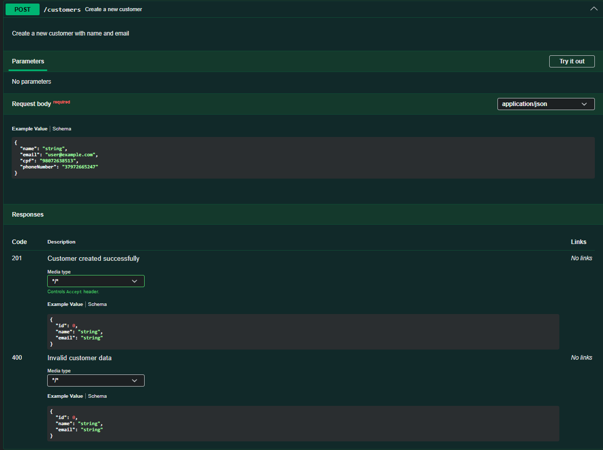

# Commerce Management API

<p align="center">
  
  
  
  
  
  
</p>

<p align="center">
  
  
  
  
</p>

---

## About This Project

**Commerce Management API** is a backend project built with **Java 21, Spring Boot 3, PostgreSQL, JPA, Flyway and OpenAPI**, designed to simulate the core flow of a real commercial system.

The project started as a customer management API and is evolving incrementally into a broader commerce backend, covering:

* Customer management
* Product management
* Order processing
* Order items
* Payment flow
* API documentation
* Validation
* Exception handling
* Testing
* Security
* Infrastructure

The goal is to build a portfolio-level backend project applying professional practices commonly used in real-world software engineering teams.

---

## Project Vision

The long-term goal is to simulate the backend core of a commercial platform where:

```text
A customer places an order
The order contains products
Each product becomes an order item
The order has a payment
The system controls status and business rules
```

Example:

```text
Customer: Sérgio

Order #1:
- Product: Mechanical Keyboard
- Quantity: 1
- Price: 300.00

Order #2:
- Product: Gaming Mouse
- Quantity: 1
- Price: 150.00
```

Planned domain model:

```text
Customer
Product
Order
OrderItem
Payment
```

---

## Project Documentation

### Order Module Diagram

The diagram below shows how the main domain entities are connected in the Order module.


### Order Creation Flow

The diagram below shows the basic flow for creating an order, including customer validation, product validation, historical price registration, subtotal calculation and total amount calculation.


You can also access the full PDF version here:

[Order Module Entity Relationship Diagram PDF](docs/diagrams/order-module-entity-relationship-diagram.pdf)

## Architecture Overview

This API follows a **Layered Architecture**, separating responsibilities to improve maintainability, testability and scalability.

```text
┌─────────────────────────────────┐
│          CLIENT (HTTP)          │
└────────────────┬────────────────┘
                 │
┌────────────────▼────────────────┐
│        CONTROLLER LAYER         │  ← HTTP requests, responses and endpoint mapping
└────────────────┬────────────────┘
                 │
┌────────────────▼────────────────┐
│          SERVICE LAYER          │  ← Business rules and application logic
└────────────────┬────────────────┘
                 │
┌────────────────▼────────────────┐
│        REPOSITORY LAYER         │  ← Data access with Spring Data JPA
└────────────────┬────────────────┘
                 │
┌────────────────▼────────────────┐
│        PostgreSQL DATABASE      │  ← Data persistence
└─────────────────────────────────┘
```

---

## System Design

```text
Client
  │
  ▼
REST API ──────────────────────────────────────────────┐
CustomerController                                      │
  │                                                     │
  ▼                                                     │
CustomerService ──── Business Rules ──── Validations   │
  │                                                     │
  ▼                                                     │
CustomerRepository                                      │
Spring Data JPA                                         │
  │                                                     │
  ▼                                                     │
PostgreSQL ◄──────── Flyway Migrations ─────────────────┘
```

---

## Current Domain Model

At the current stage, the implemented domain is focused on `Customer`.

```text
Customer
├── id           (Long)    — Auto-generated primary key
├── name         (String)  — Customer name
├── email        (String)  — Customer email
├── cpf          (String)  — Brazilian tax identifier
└── phoneNumber  (String)  — Customer phone number
```

Future entities such as `Product`, `Order`, `OrderItem` and `Payment` will be added as the project evolves.

---

## API Documentation

The API is documented using **OpenAPI 3.1** and **Swagger UI**.

After running the application locally, access:

```text
http://localhost:8080/swagger-ui/index.html
```

The Swagger documentation currently includes:

* API title, description, version and contact information
* Customer endpoint grouping with `@Tag`
* Endpoint summaries with `@Operation`
* HTTP response documentation with `@ApiResponse`
* Request and response schemas
* Validation error documentation

---

## Swagger Screenshots

### API Overview


### Customer Endpoints


### Create Customer Endpoint



---

## API Endpoints

**Base URL:** `http://localhost:8080`

| Method   | Endpoint                   | Description           | Responses                                    |
| -------- | -------------------------- | --------------------- | -------------------------------------------- |
| `GET`    | `/customers`               | List all customers    | `200 OK`                                     |
| `POST`   | `/customers`               | Create a new customer | `201 Created`, `400 Bad Request`             |
| `GET`    | `/customers/{id}`          | Get customer by ID    | `200 OK`, `404 Not Found`                    |
| `GET`    | `/customers/email/{email}` | Get customer by email | `200 OK`, `404 Not Found`                    |
| `PUT`    | `/customers/{id}`          | Update customer data  | `200 OK`, `400 Bad Request`, `404 Not Found` |
| `DELETE` | `/customers/{id}`          | Delete customer by ID | `204 No Content`, `404 Not Found`            |

---

## Request and Response Examples

### Create Customer Request

```json
{
  "name": "João Silva",
  "email": "joao.silva@email.com",
  "cpf": "12345678900",
  "phoneNumber": "81999990000"
}
```

### Customer Response

```json
{
  "id": 1,
  "name": "João Silva",
  "email": "joao.silva@email.com"
}
```

### Error Response

```json
{
  "status": 404,
  "message": "Customer not found with id: 1",
  "timestamp": "2026-06-04T10:00:00"
}
```

---

## Project Structure

```text
src/main/java
│
├── config
│   └── OpenApiConfig.java             ← OpenAPI / Swagger configuration
│
├── controller
│   └── CustomerController.java        ← REST endpoints
│
├── service
│   └── CustomerService.java           ← Business logic
│
├── repository
│   └── CustomerRepository.java        ← JPA data access
│
├── entity
│   └── Customer.java                  ← Domain entity
│
├── dto
│   ├── CustomerRequestDTO.java        ← Incoming request body
│   ├── CustomerResponseDTO.java       ← Outgoing API response
│   └── ErrorResponseDTO.java          ← Standardized error response
│
├── exception
│   ├── CustomerNotFoundException.java ← Custom domain exception
│   └── GlobalExceptionHandler.java    ← Centralized exception handling
│
├── mapper
│   └── CustomerMapper.java            ← DTO and entity conversion
│
└── CustomerManagementApiApplication.java
```

---

## Tech Stack

| Layer / Purpose       | Technology                  |
| --------------------- | --------------------------- |
| Language              | Java 21                     |
| Framework             | Spring Boot 3               |
| REST API              | Spring Web                  |
| Persistence           | Spring Data JPA / Hibernate |
| Database              | PostgreSQL                  |
| Database Migrations   | Flyway                      |
| Validation            | Spring Validation           |
| Documentation         | SpringDoc OpenAPI / Swagger |
| Build Tool            | Maven                       |
| Boilerplate Reduction | Lombok                      |
| Architecture          | Layered Architecture        |

---

## Engineering Decisions

### DTO Pattern

Entities are not exposed directly through the API.

```text
Customer Entity              CustomerResponseDTO
     │                               │
     ├── JPA annotations              ├── Clean API response
     ├── Database mapping             ├── Stable external contract
     └── Internal persistence model   └── No persistence details exposed
```

This separation keeps the API contract cleaner and reduces coupling between database structure and external consumers.

---

### Global Exception Handling

The project uses centralized exception handling with `@RestControllerAdvice`.

This avoids scattered `try/catch` blocks in controllers and provides consistent error responses across the API.

---

### OpenAPI Documentation

The API is documented using OpenAPI and Swagger UI.

The documentation was added as part of the API quality phase, covering:

* API metadata
* Customer endpoints
* HTTP response codes
* Validation scenarios
* Endpoint descriptions

---

### Clean Code vs Documentation Trade-off

During Swagger integration, the `Pageable` parameter was displayed in a less friendly way by Swagger UI.

Instead of refactoring a clean Spring implementation only to improve the Swagger visual output, the decision was to keep the current implementation because:

* The endpoint works correctly
* Postman validates the expected behavior
* The code remains clean and idiomatic with Spring Data
* The issue does not affect business value or API functionality

This reflects a real engineering trade-off: not every visual limitation requires a code refactor.

---

### Layered Architecture

Responsibilities are clearly separated:

* **Controller:** handles HTTP requests and responses
* **Service:** contains business rules and application logic
* **Repository:** handles data persistence
* **DTOs:** define the API input/output contract
* **Exception Handler:** centralizes error handling
* **Config:** centralizes application-level configuration

---

## What's Already Built

* [x] Customer CRUD
* [x] Layered Architecture
* [x] DTO Pattern
* [x] Custom Exception Handling
* [x] Global Exception Handler
* [x] Standardized Error Response
* [x] PostgreSQL Integration
* [x] Flyway Database Migrations
* [x] Bean Validation
* [x] Pagination and Sorting
* [x] OpenAPI / Swagger Documentation
* [x] Customer Endpoint Documentation

---

## Engineering Roadmap

The project evolves incrementally following backend engineering standards.

### Phase 1 — Customer API Foundation

* [x] Project setup
* [x] Database connection
* [x] Customer entity
* [x] Customer repository
* [x] Customer service
* [x] Customer controller
* [x] CRUD endpoints
* [x] DTO pattern
* [x] Exception handling
* [x] Validation
* [x] Pagination and sorting

### Phase 2 — API Documentation and Quality

* [x] OpenAPI configuration
* [x] Swagger UI setup
* [x] Customer endpoint documentation
* [ ] Improve request/response examples in Swagger
* [ ] Add structured logging

### Phase 3 — Domain Expansion

* [ ] Product management
* [ ] Order management
* [ ] Order items
* [ ] Payment module
* [ ] Order status flow

### Phase 4 — Testing

* [ ] Unit tests with JUnit 5 and Mockito
* [ ] Integration tests with Spring Boot Test
* [ ] Testcontainers with PostgreSQL
* [ ] Test coverage report

### Phase 5 — Security

* [ ] Spring Security
* [ ] JWT authentication
* [ ] Role-based authorization
* [ ] Password encoding with BCrypt

### Phase 6 — Infrastructure and DevOps

* [ ] Dockerfile
* [ ] Docker Compose
* [ ] GitHub Actions CI/CD pipeline
* [ ] Health check endpoint with Spring Actuator

### Phase 7 — Scalability and Observability

* [ ] Redis cache layer
* [ ] Async messaging with RabbitMQ or Kafka
* [ ] Metrics with Prometheus and Grafana
* [ ] Distributed tracing

---

## Running Locally

### Prerequisites

* Java 21+
* Maven
* PostgreSQL running locally

### Clone the repository

```bash
git clone https://github.com/SergioFeitosaa/customer-management-api.git
cd customer-management-api
```

### Run the application

```bash
./mvnw spring-boot:run
```

On Windows:

```bash
mvnw.cmd spring-boot:run
```

The application will run at:

```text
http://localhost:8080
```

Swagger UI will be available at:

```text
http://localhost:8080/swagger-ui/index.html
```

---

## Learning Goals

This project is being built incrementally to strengthen backend development skills in:

* Java backend development
* Spring Boot REST APIs
* Clean code and layered architecture
* API documentation
* Database persistence
* Validation and exception handling
* Testing strategies
* Security fundamentals
* DevOps and deployment practices

---

## Author

**Sérgio Ricardo Feitosa**

Backend Java Developer in progress, transitioning from a legal career into software engineering, focused on Java, Spring Boot, clean architecture and backend system design.

Building practical projects with consistency, documentation and real-world engineering decisions.

<p>
  <a href="https://www.linkedin.com/in/s%C3%A9rgiofeitosa/">
    
  </a>
  <a href="https://github.com/SergioFeitosaa">
    
  </a>
</p>
